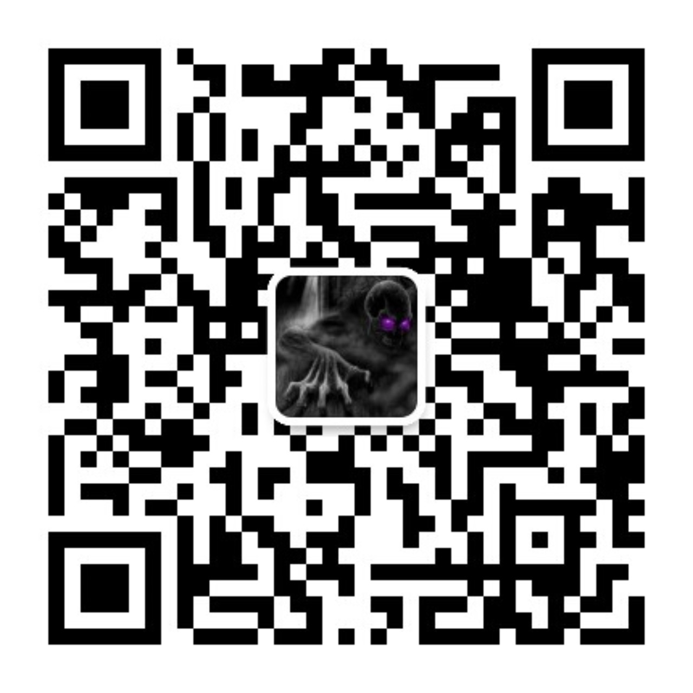

# My LLM Knowledge Book

This repository is my personal knowledge base for Large Language Models (LLMs).

集中收集了一下，我自己的笔记，尤其是已经通过微信公众号，发布的内容。

主要是这里显示的更全，微信公众号还是有一些限制。

## 有兴趣的老板也可以关注一下

有一些已经发布的文章在陆续的整理进来。最近失业在家。有的是时间。

## Table of Contents

### Transformer Architecture Notes

*   [核心步骤 1：Tokenization (分词)](./Transformer结构分章节笔记/核心步骤%201：Tokenization%20(分词).md)
*   [核心步骤 2：Embedding (词向量转换)](./Transformer结构分章节笔记/核心步骤%202：Embedding%20(词向量转换).md)
*   [核心步骤 3：Position Embedding (位置编码)](./Transformer结构分章节笔记/核心步骤%203：Position%20Embedding%20(位置编码).md)
*   [核心步骤 4：Encoder (编码器)](./Transformer结构分章节笔记/核心步骤%204：Encoder%20(编码器).md)

## License

This project is licensed under the MIT License - see the [LICENSE](./LICENSE) file for details.
