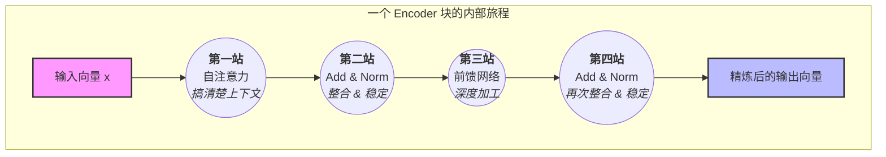
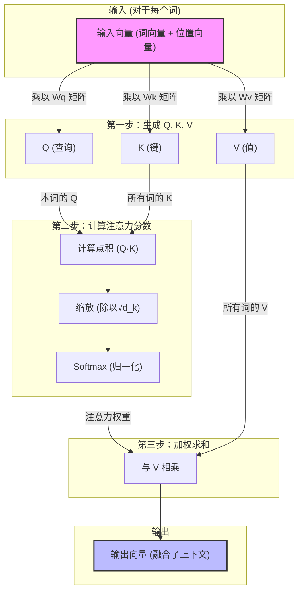
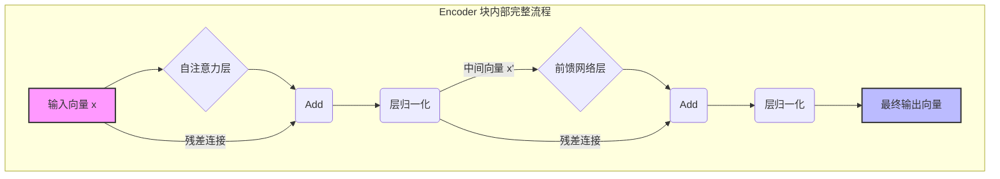

# 核心步骤 4：Encoder (编码器)

我们上一步合成的“最终输入向量”，现在要进入 Transformer 的核心计算引擎——**Encoder (编码器)**。

### 编码器的核心目标：精细化语义

那么，这个“深度加工”的最终目标是什么？用一句话概括就是**精细化语义 (Semantic Refinement)**。

您可以这样理解这个“精细化”的过程：

1.  **初始输入**：刚进入 Encoder 的向量，虽然包含了词本身的含义（比如“bank”可能同时包含“银行”和“河岸”的模糊概念），但它们是**孤立的、上下无感**的。

2.  **核心任务**：通过内部的**自注意力机制 (Self-Attention)**，强制每个词去“看”句子中的所有其他词。这就像让每个词参加一个会议，根据上下文（比如句子中出现了“money”和“deposit”），来明确自己在这里到底应该扮演哪个角色。

3.  **逐层深化**：一个 Encoder 通常由很多层（例如6层）堆叠而成。
    *   **第一层 Encoder** 可能只是让 "bank" 明确了自己是“银行”而不是“河岸”。
    *   **更深层的 Encoder** 会在“银行”这个概念上，融入更丰富的上下文信息，比如这个“银行”是“我存钱的那个银行”，它的状态、它与句子中其他成分的关系等等。

随着向量在 Encoder 栈中逐层向上传递，它所蕴含的“语义”就变得越来越不“模糊”，越来越“精确”，越来越“深刻”，完全融入了它所在的特定语境中。

最终，Encoder 输出的是一套经过了深度加工、充满了上下文信息的、高度“精炼”的语义表示，为后续的 Decoder 或者其他任务（如分类、问答）做好了最关键的准备。

---

你可以把 Encoder 看作一个“深度加工”的工厂。一个完整的 Encoder 由一堆（例如6个）结构完全相同的 **Encoder 块 (Block)** 堆叠而成。我们送入的向量，会依次穿过这些块，在每一层都被“精炼”和“升级”。

### 单个 Encoder 块的内部逻辑

下面我们用一个更形象的“旅程”来描述一个输入向量 `x` 在**单个 Encoder 块**内部的逻辑。这个旅程包含四个核心站点：

1.  **第一站：自注意力层 (Self-Attention)**
    *   **目的**：搞清楚上下文。
    *   **过程**：向量 `x` 在这里会和其他所有词的向量进行“交流”（通过Q/K/V计算），吸收全局信息，生成一个**融合了上下文的新向量**。这是为了回答“在当前这个句子中，考虑到所有其他词，我真正的含义是什么？”

    > **备注：Q/K/V 是如何产生的？**
    > Q, K, V 并非在进入 Encoder 之前计算，而是在**每一个 Encoder 块内部**的“自注意力 (Self-Attention)”层中，由当前层的输入向量动态生成的。
    > 具体来说，当一个词的向量 `x` 进入自注意力层时，它会通过与三个独立的、在训练中学习到的权重矩阵（`Wq`, `Wk`, `Wv`）相乘，分别得到该词在当前上下文中的 `Q` (查询)向量、`K` (键)向量 和 `V` (值)向量。这个过程对每个词、在每一层都会重复执行。

2.  **第二站：Add & Norm (残差连接与层归一化)**
    *   **目的**：整合信息并保持稳定。
    *   **过程**：把上一站得到的“上下文向量”与最原始的输入向量 `x` **相加**（确保不丢失原始信息），然后对结果进行一次“标准化”处理（让数据更稳定，便于训练）。

3.  **第三站：前馈神经网络 (Feed-Forward Network)**
    *   **目的**：深度加工与思考。
    *   **过程**：经过上一步稳定化的向量，在这里会进行一次独立的、更深度的“思考”和“加工”，通过非线性变换提取出更高层次的抽象特征。

4.  **第四站：再次 Add & Norm**
    *   **目的**：再次整合信息并保持稳定。
    *   **过程**：与第二站类似，把第三站加工后的结果与进入第三站之前的向量相加，并再次进行标准化。

这个四步流程走完，一个 Encoder 块的工作就完成了。输出的向量相比输入的向量，其“语义”已经被“精炼”了一次。然后，这个精炼后的向量会被传递给下一个 Encoder 块，重复上述完全相同的旅程，进行更深层次的精炼。

---

每个 Encoder 块内部，都由两个核心组件构成：

#### 组件 1：自注意力机制 (Self-Attention) —— 一场高效的“内部会议”

这是 Transformer 最核心的魔力所在。它的目标是：**让句子中的每个词，都能“看”到其他所有词，并判断哪些词与自己最相关，然后从这些相关的词中吸收信息来更新自己。**

让我们用一个开会的比喻来理解：

*   **与会者**：句子中的每一个词向量（比如“我”、“喜欢”、“猫”）都是一位与会者。
*   **开会目标**：更新每个词的含义，让它包含上下文信息。例如，在句子 “The animal didn't cross the street because **it** was too tired” 中，我们希望 “it” 这个词能明白它指的是 “The animal”。

为了实现这一点，每个词向量在进入自注意力层后，会通过一次精确的线性变换（矩阵乘法）来生成 Q/K/V。在“自注意力”车间内部，有三台专门的“加工机器”（其实是三个独立的、在训练中学习到的**权重矩阵**，我们称它们为 `Wq`、`Wk`、`Wv`）。

输入词向量会**同时被这三台机器分别加工一次**：
*   `输入向量` x `Wq` 矩阵  ->  `Q` 向量 (查询向量)
*   `输入向量` x `Wk` 矩阵  ->  `K` 向量 (键向量)
*   `输入向量` x `Wv` 矩阵  ->  `V` 向量 (值向量)

这三个 `Wq`, `Wk`, `Wv` 矩阵是自注意力机制的核心参数，它们在训练中被不断优化，目的就是学会如何从原始向量中提取出最适合用于“查询匹配”（生成Q和K）和“提供信息”（生成V）的特征。

生成了这三个承担不同角色的新向量后，它们才会被用于我们接下来要讲的“会议流程”中，分别承担以下角色：
1.  **Query (查询) `Q`**: 代表“**我正在寻找谁？**” —— 我自己的提问或关注点。
2.  **Key (键) `K`**: 代表“**我是谁？**” —— 我用来被别人检索的“关键词”或“名片”。
3.  **Value (值) `V`**: 代表“**我能提供什么信息？**” —— 我实际的、可以分享给别人的内容。

**“会议”核心流程：使用 Q, K, V 计算注意力**
1.  **第1步：计算相关性 (Q · K)** - 每个词的 `Query` 向量，都需要和**所有**词的 `Key` 向量做一次点积运算，得到一个“原始相关度分数”。
2.  **第2步：缩放与归一化 (Scale & Softmax)** - 将得到的分数除以一个缩放因子（通常是K向量维度的平方根），然后通过 Softmax 函数，将分数转换成 0 到 1 之间、总和为 1 的“注意力权重”。这个权重代表了“应该对每个词投入多少注意力”。
3.  **第3步：加权求和 (Weighted Sum of V)** - 使用上一步得到的注意力权重，去加权求和**所有**词的 `Value` 向量。
4.  **第4步：得到输出** - 这个加权求和的结果，就是该词经过这轮注意力计算后，得到的最终输出向量。它已经融合了句子中所有其他词的相关信息。

> **一个精妙的追问：可以理解 Wq, Wk, Wv 就是特征吗？**
>
> 这是一个非常好的问题！我们可以用一个更精确的描述：`Wq`, `Wk`, `Wv` 与其说是“特征”本身，不如说是“**特征提取器**” (Feature Extractors)。
>
> *   **真正的“特征”**，是我们送入自注意力层的**输入向量**（词向量+位置向量）。这个向量已经是一个包含了丰富信息的高维特征。
> *   **`Wq`, `Wk`, `Wv` 的角色**，是三个训练有素的“专家”或“滤镜”。它们分别从输入的这个高维特征中，提取出三个不同方面、对注意力计算最有用的“子特征”：
>     *   `Wq` 负责提取出最适合**发起查询**的“查询特征”。
>     *   `Wk` 负责提取出最适合**被查询、被匹配**的“关键特征”。
>     *   `Wv` 负责提取出最适合**作为内容被传递**的“价值特征”。
>
> 这就像在图像处理中，一个“边缘检测”滤镜本身不是特征，但它能从原始图片中提取出“边缘”这个特征。同理，`Wq` 等权重矩阵，就是模型学习到的、用来从原始词向量中提取 Q, K, V 这三个关键子特征的“智能滤镜”。

#### “辅助组件”：Add & Norm (残差连接与层归一化)

在你理解了两个核心“车间”后，还需要了解两个至关重要的“辅助工序”——**Add & Norm**。它们是保证这个深度工厂能够顺利运转的关键。

1.  **Add (残差连接 - Residual Connection)**
    *   **做什么？** 将一个“车间”（如“自注意力”层）的**输出向量**，与进入该车间之前的**原始输入向量**，直接**相加**。
    *   **为什么？** 这相当于为信息流创建了一条“高速公路”或“捷径”。它能确保模型在学习新的、复杂的上下文信息时，不会“忘记”原始的、最根本的信息。这对于训练非常深的网络至关重要，能有效防止梯度消失问题，让信息顺畅地在多层之间传递。

2.  **Norm (层归一化 - Layer Normalization)**
    *   **做什么？** 在相加之后，对得到的向量进行“标准化”处理，使其内部的数值分布稳定在一个标准的范围内（例如，均值为0，方差为1）。
    *   **为什么？** 这就像一个“稳压器”。它能确保每一层网络处理的向量都处在一个稳定、一致的数值尺度上，避免在深度计算中出现数值爆炸或消失的问题，从而让整个训练过程更稳定、更快速。

一个 Encoder 块内部更完整的、真实的流程是：
1.  输入向量 `x` 进入**自注意力**层，得到输出 `Att(x)`。
2.  进行**残差连接**：`x_after_add1 = x + Att(x)`。
3.  进行**层归一化**：`x_after_norm1 = LayerNorm(x_after_add1)`。
4.  标准化后的 `x_after_norm1` 进入**前馈网络**层，得到输出 `FFN(x_after_norm1)`。
5.  再次进行**残差连接**：`x_after_add2 = x_after_norm1 + FFN(x_after_norm1)`。
6.  再次进行**层归一化**：`x_after_norm2 = LayerNorm(x_after_add2)`。
7.  最终得到的 `x_after_norm2` 才是这个 Encoder 块的最终输出。

`Add & Norm` 这两个“辅助工序”在 `Self-Attention` 和 `Feed-Forward Network` **之后**都会成对出现，它们是保证 Transformer 能够被成功训练成一个深度模型的关键“粘合剂”。

> **专家提示：一个重要的架构演进**
> 你描述的 `子层 -> Add -> Norm` 结构被称为 **Post-LN (后置归一化)**，是原始论文中的经典设计，完全正确。
> 值得注意的是，许多现代 Transformer（如GPT系列）为了追求更稳定的训练过程，采用了一种名为 **Pre-LN (前置归一化)** 的变体，其执行顺序为 `Norm -> 子层 -> Add`。了解您文档中描述的 Post-LN 经典结构，是理解后续这些重要演进的基础。

##### Encoder 块完整流程图

#### 组件 2：前馈神经网络 (Feed-Forward Network) —— “消化吸收”与“深度思考”

经过了“开会”（Self-Attention）和“Add & Norm”之后，每个词向量都已经吸收了丰富的上下文信息。现在，它需要进入 Encoder 块的第二个核心组件——**前馈神经网络 (FFN)** ——来进行一次深度的、独立的“消化和思考”。

**FFN 的作用是什么？**

自注意力层非常擅长在不同的词之间“混合”信息，但这种混合本质上是线性的（它是对 Value 向量的加权求和）。为了让模型能学习到更复杂的函数和更深层次的模式，我们需要为它注入**非线性 (Non-linearity)** 的处理能力。

> **备注：线性与非线性模型的区别**
> 
> *   **线性模型**：可以理解为只能用“直尺”画线。它假设输入和输出之间是简单的、成比例的关系（如 `y = ax + b`），模型简单、计算快，但能力有限。
> *   **非线性模型**：可以理解为能用“可弯曲的铁丝”画线。它能捕捉复杂的模式，在神经网络中，这是通过**非线性激活函数**（如 `GELU`, `ReLU`）实现的，它给模型增加了“关节”，使其能够“弯曲”。
> 
> 如果没有 FFN 引入的非线性能力，整个 Transformer 无论堆叠多少层，本质上都只是一个巨大的线性模型，其表达能力将大打折扣。

FFN 的主要作用就是：
1.  **增加非线性**：为模型引入非线性计算，极大地增强了模型的表达能力。如果没有这个组件，无论 Transformer 堆叠多少层，其效果也只相当于一个复杂的线性模型。
2.  **深度加工**：对自注意力层输出的信息进行一次复杂的特征变换和提炼。

你可以把它理解为，每个词向量在吸收了全局信息后，在这里进行一次“闭关修炼”和“深度思考”，从而领悟出更深层次的见解。

**FFN 内部做了什么？**

它通常是一个结构简单但非常有效的两层全连接神经网络，对**每一个词向量独立地**执行以下三步：

1.  **第一层：扩展 (Expansion)**
    *   用一个线性变换（乘以权重矩阵 `W1` 并加上偏置 `b1`），将输入的向量从原始维度（例如 768）扩展到一个**更大的中间维度**（例如 3072，通常是原始维度的4倍）。
    *   **类比**：这就像为了解决一个复杂问题，我们先把问题“升维”，在更广阔的“思考空间”里寻找解决方案。

2.  **激活函数 (Activation)**
    *   在扩展后的向量上，应用一个**非线性激活函数**，在现代 Transformer 中最常用的是 **GELU** (Gaussian Error Linear Unit)，早期的模型则常用 ReLU。
    *   **这是注入“非线性”的关键一步**。它打破了纯粹的线性关系，使得模型能够学习和表示远比线性组合复杂得多的模式。

3.  **第二层：收缩 (Contraction)**
    *   用第二个线性变换（乘以权重矩阵 `W2` 并加上偏置 `b2`），将向量从更大的中间维度，再“压缩”回**原始维度**（例如 768）。
    *   **类比**：这相当于把在“高维思考空间”里得到的解决方案，再投影回原始的维度空间，以便于下一个 Encoder 块继续处理。

**总结来说**，FFN 对每个词向量都独立地执行了一次 `扩展 -> 非线性激活 -> 收缩` 的“升维思考再降维”的过程。虽然它很简单，但它赋予了 Transformer 模型拟合复杂模式的强大能力。

> **备注：偏置项 (Bias) 是什么？**
> 
> FFN 中的偏置项（如 `b1`, `b2`）和权重矩阵（`W1`, `W2`）一样，都是**通过训练学习来的参数 (learnable parameters)**。
> 
> 1.  **初始化**：在训练开始前，它们通常被设为 0。
> 2.  **学习**：在训练过程中，模型通过反向传播算法，根据预测效果不断自动微调它们的值。
> 
> 偏置项的作用类似于直线方程 `y = ax + b` 中的 `b`（截距）。它为数据变换提供了一个“偏移量”，让模型不必被限制在“必须通过原点”的变换上，从而极大地增加了模型的灵活性和表达能力。

**总结一下 Encoder 块的流程：**

一个向量进入 Encoder 块 -> 通过 Self-Attention 与全局信息互动 -> 输出的向量再通过前馈网络进行深度加工 -> 完成一次“精炼”，然后进入下一个 Encoder 块，重复此过程。

---
### 附录：实例追踪——“我喜欢猫”的旅程

为了让概念更具体，让我们以一个极其简化的方式，追踪 “我 喜欢 猫” 这句话在单个 Encoder 块中的推理过程。

#### 准备阶段：向量化

首先，这句话被分成三个词：`[我, 喜欢, 猫]`。每个词都通过词嵌入表（Embedding a lookup table）转换成一个初始的、**不包含任何上下文**的词向量。同时，我们为它们加上位置编码，来表示它们的顺序。

我们得到了三个输入向量：
*   `X_我` (包含了“我”的语义和“位置1”的信息)
*   `X_喜欢` (包含了“喜欢”的语义和“位置2”的信息)
*   `X_猫` (包含了“猫”的语义和“位置3”的信息)

现在，这三个向量被同时送入第一个 Encoder 块。

---

#### 旅程开始：单个 Encoder 块内部

##### **第一站：自注意力层 (搞清楚上下文)**

这是最关键的一步。三个向量在这里将互相“交流”，更新自己。我们重点看 `X_喜欢` 是如何更新的：

1.  **生成 Q, K, V**：`X_喜欢` 这个向量会通过乘以三个不同的权重矩阵，摇身一变，生成三个代表不同角色的新向量：`Query_喜欢`, `Key_喜欢`, `Value_喜欢`。（`X_我` 和 `X_猫` 也做同样的事，生成各自的 Q, K, V）。

2.  **计算相关性**：`Query_喜欢` 会和**所有词**的 `Key` 向量进行点积计算(就是线性代数上的“内积计算”)，来判断“我该关注谁”：
    *   `Query_喜欢` · `Key_我`  ->  得到一个分数 (很可能很高，因为“谁”喜欢很重要)
    *   `Query_喜欢` · `Key_喜欢` ->  得到一个分数 (关注自身)
    *   `Query_喜欢` · `Key_猫`  ->  得到一个分数 (也很可能很高，因为“喜欢什么”很重要)

    > **备注：点积计算 (Dot Product) 是什么？**
    > 
    > 点积是衡量两个向量“相似度”的计算方法。它将两个向量对应位置的元素相乘，然后将所有结果相加，最终得到一个单独的数字（标量）。
    > 
    > *   **计算示例**：向量 `[1, 2]` 和 `[3, 4]` 的点积是 `(1*3) + (2*4) = 11`。
    > *   **作用**：这个得到的数字（分数）代表了两个向量的相关性。分数越高，代表方向越接近，相关性越强。在自注意力中，这个分数就是计算“注意力权重”的基础。

3.  **分配注意力权重**：这些分数经过 Softmax 函数的归一化后，变成了 0 到 1 之间的“注意力权重”。假设（完全是假设）`X_喜欢` 计算出的权重是：
    *   对“我”的注意力：**0.5**
    *   对“喜欢”的注意力：**0.1**
    *   对“猫”的注意力：**0.4**

    > **备注：Softmax 数学计算**
    > 上述的权重是通过 Softmax 函数从原始分数计算得出的。其目的是将一组任意分数转换为总和为 1 的概率分布。计算过程如下：
    > 1.  **取指数**：对每个原始分数 `z`，计算 `e^z`，将其映射到正数并放大差异。
    > 2.  **归一化**：将上一步得到的每个指数值，除以**所有指数值的总和**，得到最终的权重。
    >
    > **公式为**：`Softmax(z_i) = e^(z_i) / Σ(e^(z_j))`

4.  **加权求和，更新自己**：`X_喜欢` 的新向量 `Z_喜欢`，就是将**所有词**的 `Value` 向量，根据上面的权重加权求和得到的：
    `Z_喜欢` = (0.5 * `Value_我`) + (0.1 * `Value_喜欢`) + (0.4 * `Value_猫`)

**【核心洞察】**：经过这一步，新的 `Z_喜欢` 向量不再是原来那个孤立的“喜欢”了。它内部已经包含了“**由‘我’发出**”和“**作用于‘猫’**”的信息。它变成了一个在当前语境下，高度定制化的、独一无二的“喜欢”。

> **备注：如何理解“核心洞察”？**
>
> 这句话的本质是：**通过加权求和，将上下文的语义信息编码（融合）到词向量中。**
>
> 1.  **发生了什么？—— 向量的“移动”**
>     *   **原始的“喜欢”** 是一个通用的、字典式的概念，其向量在空间中有一个“标准坐标”。
>     *   **新的 `Z_喜欢`** 是一个在向量空间中被“拉动”过的向量。公式 `Z_喜欢 = (0.5 * Value_我) + (0.1 * Value_喜欢) + (0.4 * Value_猫)` 意味着，新的“喜欢”向量在位置上被显著地拉向了“我”和“猫”的向量方向。正因为在数学上靠近了，所以它就融合了它们的语义信息。
>
> 2.  **为什么能实现？—— “两步走”策略**
>     *   **第一步：权重是“语义关系”的判断。** 模型如何知道“我”和“猫”重要？因为它在海量训练中学会了：动词的 `Q` (查询) 能“识别”出主语和宾语的 `K` (键)。因此，计算出的高权重本身就是模型对句子结构分析的结果。
>     *   **第二步：加权求和是“语义信息”的融合。** 在判断出谁重要后，加权求和就像调制一杯“语义鸡尾酒”，将重要的词（“我”和“猫”）的 `V` (实际内容)，按权重比例混合到“喜欢”的向量中。
>
> 综上，`Z_喜欢` 不再是一个孤立的点，而是一个吸收了“由谁发出”和“作用于谁”上下文信息的新向量，实现了语义的精确化。

（`X_我` 和 `X_猫` 也经过了同样的过程，变成了吸收了上下文的新向量 `Z_我` 和 `Z_猫`）

##### **第二站：Add & Norm (整合 & 稳定)**

*   `中间向量_喜欢` = `LayerNorm(X_喜欢 + Z_喜欢)`
*   我们把刚刚学到的上下文信息 `Z_喜欢`，加回到原始的 `X_喜欢` 之上。这确保了模型在学习新东西（上下文）时，不会忘记自己是谁（原始词义）。

##### **第三站：前馈网络 (深度加工)**

*   `中间向量_喜欢` 会被送入一个独立的神经网络进行一次“闭关修炼”。
*   这个网络可能会识别出 `Z_喜欢` 中体现出的“主-谓-宾”结构特征，并对这个特征进行放大和提炼，让这个“喜欢”作为“动作/谓语”的属性更加突出。

##### **第四站：再次 Add & Norm**

*   与第二站类似，对前馈网络的输出再次进行整合与稳定。
*   至此，我们得到了这个 Encoder 块最终的输出向量 `Output_喜欢`。

---

#### 旅程的下一段：进入下一个 Encoder

这个 `Output_喜欢` 包含了第一层所能理解的全部上下文信息。但这还不够“深”。

它会作为**输入**，和 `Output_我`、`Output_猫` 一起，被送入**第二个 Encoder 块**，然后完全重复上述的“四站旅程”。

在第二层网络中，因为输入的向量已经富含上下文，模型可以学到更抽象的概念。比如，它可能不再仅仅关注“我喜欢猫”，而是从这些高度精炼的向量中，提炼出一种“**正面情感**”的通用特征。

这个过程会重复 N 次（N 就是模型的层数）。

#### 最终输出

当三个向量走完所有（比如12个）Encoder 块后，最终输出的三个向量，就是对原始 “我 喜欢 猫” 这句话最深度、最精确的理解。每一个向量都充分蕴含了它自身、它的位置以及它与句子中所有其他词的复杂关系。